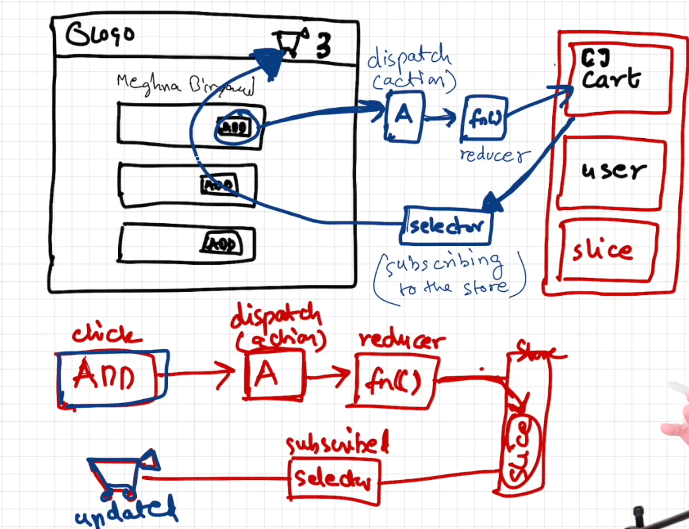

# Episode 12: Let's Learn Redux

## Overview
This episode focuses on building a store using React and Redux, with an emphasis on state management and component architecture. We will create a simple store application that allows users to add, remove, and view items in the cart using Redux for state management.

---

## Understanding Redux Architecture

<div style="display: flex; flex-wrap: wrap; gap: 20px; align-items: flex-start;">
<div style="flex: 1 1 400px; min-width: 400px;">

</div>
<div style="flex: 1 1 300px; min-width: 300px; padding: 10px;">

**Redux Data Flow:** Complete flow from components to store and back

**Store:** Central state container with slices (Cart, User, etc.)

**Actions:** Plain objects describing what happened

**Dispatch:** Method to send actions to the store  

**Reducer:** Functions that update state based on actions

**Selector:** Functions that read/extract data from store

**Subscribing:** Components connect to store via selectors to get updates

</div>
</div>

---

## How the Cart Feature Works in Redux Store

### Writing Data to the Redux Store

The cart functionality follows Redux's unidirectional data flow pattern:

#### 1. Global State Management
- The cart is a global state that can be accessed and modified by various components throughout the application
- This global state is managed by Redux and stored in the Redux store

#### 2. Redux Rules
- You cannot directly modify the global state in Redux
- Instead, you must dispatch actions that describe what you want to do with the state

#### 3. Add to Cart Flow
When you click the "Add to Cart" button, the following process occurs:

1. **Action Dispatch**: It dispatches an action that describes the item you want to add to the cart
2. **Store Function Call**: This action calls a function in the Redux store
3. **Reducer Execution**: That function (called a **reducer**) internally modifies the global state of the cart slice in the Redux store
4. **State Update**: The reducer updates the cart slice in the Redux store
5. **Data Addition**: The cart items data is added to the cart slice

**Important Note**: A reducer is a pure function that takes the current state and an action, and returns a new state based on the action type and payload.

### Reading Data from the Redux Store

- When you want to read cart items data from the Redux store, you use a **selector** function
- The selector function returns the cart items data from the cart slice of the Redux store
- This allows components to access the current state of the cart
- When we use a selector, this phenomenon is called **subscribing** to the Redux Cart store. This means the Header component (cart) subscribes to the Redux cart store through the selector function

---

## Redux Toolkit Dependencies and Setup

### Required Packages
To build our Redux store, we need to install:
- **@reduxjs/toolkit**: Provides utilities to simplify Redux development, including store setup, reducers, and actions
- **react-redux**: Provides bindings to connect React components to the Redux store, allowing components to access and update the Redux state

```bash
npm install @reduxjs/toolkit react-redux
```

### Implementation Steps
1. **Build our Store**
2. **Connect our components to the store**
3. **Create Slice (CartSlice)**
4. **Dispatch actions to the store**
5. **Create a selector to read data from the store**

---

## Let's Build a Store - Step by Step Implementation

### Step 1: Setup Redux Store in appStore.js
Create a Redux store using `configureStore({})` from `@reduxjs/toolkit` and combine all slices (e.g., cartSlice) into the store.

```javascript
import { configureStore } from '@reduxjs/toolkit';
import cartReducer from './cartSlice';

const store = configureStore({
    reducer: {
        cart: cartReducer
    }
});

export default store;
```

### Step 2: Create Cart Slice
Use `createSlice` to define the cart slice, including initial state, reducers (e.g., addItem, removeItem), and selectors.

```javascript
import { createSlice } from "@reduxjs/toolkit";

const cartSlice = createSlice({
    name: "cart",
    initialState: {
        items: [],
        totalItems: 0
    },
    reducers: {
        addItem: (state, action) => {
            // In Redux Toolkit, we can directly mutate the state
            state.items.push(action.payload);
            state.totalItems = state.items.length;
        },
        removeItem: (state, action) => {
            state.items = state.items.filter(item => item.id !== action.payload.id);
            state.totalItems = state.items.length;
        },
        clearCart: (state) => {
            state.items = [];
            state.totalItems = 0;
        }
    }
});

// Export actions for use in components
export const { addItem, removeItem, clearCart } = cartSlice.actions;

// Export reducer for store configuration
export default cartSlice.reducer;
```

### Step 3: Connect Components to Store
Use the `Provider` component from `react-redux` to make the store available to the entire app.

#### In App.js (or index.js):
```javascript
import React from 'react';
import ReactDOM from 'react-dom';
import { Provider } from 'react-redux';
import store from './utils/appStore';
import App from './App';

ReactDOM.render(
    <Provider store={store}>
        <App />
    </Provider>,
    document.getElementById('root')
);
```

### Step 4: Connect Components Using Hooks
Connect components to the store using `useSelector` (for reading data) and `useDispatch` (for dispatching actions).

#### Example in Header.js (Reading Cart Data):
```javascript
import React from 'react';
import { useSelector } from 'react-redux';

const Header = () => {
    // Subscribe to cart items from the store
    const cartItems = useSelector((store) => store.cart.items);
    const totalItems = useSelector((store) => store.cart.totalItems);

    return (
        <div className="header">
            <nav>
                <ul>
                    <li>Home</li>
                    <li>About</li>
                    <li>Cart ({totalItems})</li>
                </ul>
            </nav>
        </div>
    );
};

export default Header;
```

#### Example in ItemList.js (Dispatching Actions):
```javascript
import React from 'react';
import { useDispatch } from 'react-redux';
import { addItem } from '../utils/cartSlice';

const ItemList = ({ items }) => {
    const dispatch = useDispatch();

    const handleAddItem = (item) => {
        // Dispatch action to add item to cart
        dispatch(addItem(item));
    };

    return (
        <div>
            {items.map((item) => (
                <div key={item.id} className="item-card">
                    <h3>{item.name}</h3>
                    <p>Price: ${item.price}</p>
                    <button 
                        onClick={() => handleAddItem(item)}
                        className="add-btn"
                    >
                        Add to Cart
                    </button>
                </div>
            ))}
        </div>
    );
};

export default ItemList;
```
- Complete cart Example is shown in `Cart.js` where you can view items, remove them, and clear the cart.
---

## Important Notes and Best Practices

### Function Reference vs Function Call
**Difference between `() => handleAddItem(item)` and `handleAddItem(item)`:**

- **`() => handleAddItem(item)`**: This creates a new function that calls `handleAddItem` with the `item` argument when invoked. It is useful when you need to pass parameters to the function in event handlers.
- **`handleAddItem(item)`**: This directly calls the function with the `item` argument immediately. It is used when you want to execute the function right away without creating a new function.

```javascript
// Correct - Creates function to be called later
<button onClick={() => handleAddItem(item)}>Add Item</button>

// Incorrect - Calls function immediately during render
<button onClick={handleAddItem(item)}>Add Item</button>

// Alternative correct approach - using bind
<button onClick={handleAddItem.bind(null, item)}>Add Item</button>
```
---
### Important Points in Redux

#### 1. useSelector Best Practices
**Always subscribe to specific portions of the store:**

```javascript
// ✅ Good - Subscribe to specific data
const cartItems = useSelector((store) => store.cart.items);

// ❌ Bad - Subscribes to entire store (poor performance)
const store = useSelector((store) => store);
const cartItems = store.cart.items; // This is very inefficient
```

**Why the second approach is bad:**
- Subscribes to the entire store, causing unnecessary re-renders
- Component re-renders whenever ANY part of the store changes
- Poor performance and inefficient memory usage

#### 2. Reducer vs Reducers
**Understanding the terminology:**

- **`reducer` (singular)**: In the store configuration (`configureStore`), you create one big reducer for your entire store that combines all slice reducers:
  ```javascript
  const store = configureStore({
      reducer: { // This is one big reducer
          cart: cartReducer,
          user: userReducer,
          products: productsReducer
      }
  });
  ```

- **`reducers` (plural)**: In slice files (`createSlice`), there are multiple small reducer functions, that's why it's called `reducers`:
  ```javascript
  const cartSlice = createSlice({
      name: "cart",
      initialState: { items: [] },
      reducers: { // Multiple small reducer functions
          addItem: (state, action) => { /* logic */ },
          removeItem: (state, action) => { /* logic */ },
          clearCart: (state, action) => { /* logic */ }
      }
  });
  ```

#### 3. Redux Toolkit vs Vanilla Redux
**State Mutation Rules:**

- **Older Vanilla Redux**: 
  - Don't mutate the state directly
  - Always return a new state object in reducer functions
  - Use spread operators or libraries like Immer
  
  ```javascript
  // Vanilla Redux approach
  case 'ADD_ITEM':
      return {
          ...state,
          items: [...state.items, action.payload]
      };
  ```

- **Redux Toolkit (Modern Approach)**:
  - You can directly mutate the state (Redux Toolkit uses Immer under the hood)
  - No need to return new state objects
  - Simpler and more intuitive code
  
  ```javascript
  // Redux Toolkit approach
  addItem: (state, action) => {
      state.items.push(action.payload); // Direct mutation is allowed
  }
  ```
- But Internally when you are using Redux Toolkit, it still ensures immutability by using Immer, so you can safely mutate the state without worrying about breaking immutability rules.(means still first make a copy of state and then mutate it by finding diff between actual state and new state).
Thats why when you use state=[], directly in CartSlice like in clearcart logic when you do directly state=["bala"] then its not working because its not muatating the state its just give refrence.

#### Redux Devtools: You have to install extension thats known as Redux Devtools

---
## Summary

### Key Achievements in Episode 12:
1. **Redux Store Setup**: Successfully configured a Redux store using Redux Toolkit
2. **State Management**: Implemented global cart state management
3. **Component Integration**: Connected React components to Redux store
4. **Action Dispatching**: Learned how to dispatch actions to modify state
5. **Data Subscription**: Implemented data reading through selectors
6. **Modern Redux**: Used Redux Toolkit's simplified approach with direct state mutation

### Technologies Mastered:
- **@reduxjs/toolkit**: Modern Redux development
- **react-redux**: React-Redux integration
- **State Management Patterns**: Global state architecture
- **Component Architecture**: Redux-connected components

This episode demonstrates how Redux provides a robust solution for managing complex application state, enabling predictable state updates and efficient data sharing across components.


